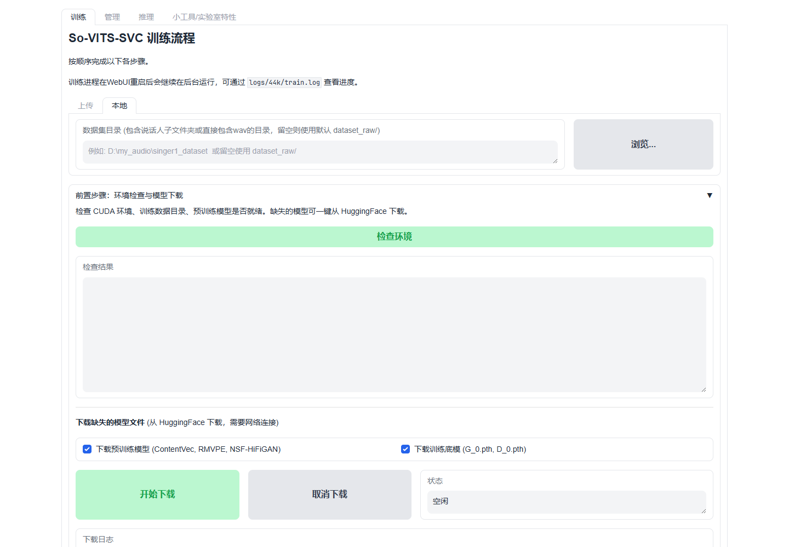

# So-VITS-SVC-Cu12.8-GUI Fork

[简体中文](README.md) | [English](README_en.md)

This project is a fork of [so-vits-svc](https://github.com/svc-develop-team/so-vits-svc) (SoftVC VITS Singing Voice Conversion). It adds a **Gradio WebUI** for visual training, inference, and model management. The target environment is **CUDA 12.8**, with support for RTX 50-series GPUs that the upstream project does not provide, along with compatibility fixes for newer PyTorch versions on Windows.

See [CHANGELOG.md](CHANGELOG.md) for the full history of changes.
Prebuilt package QQ group: 1104444127

## Quick Start

This project is distributed as source code and requires a separate runtime environment. If you do not want to install the dependencies manually, you can use the preconfigured cloud image or download the prebuilt package with the environment included.

This section only covers project deployment. For detailed usage instructions, see the [So-VITS-SVC User Guide (Simplified Chinese)](https://www.yuque.com/shenhanwen-ozfty/oogl43/dim2na4llgo3quz9?singleDoc#).

### Use a Preconfigured Cloud Image (Recommended)

- Compshare: https://www.compshare.cn/images/bYafh6fXRTsK?referral_code=n2qzZuyGlyDPbOYHPvUGy

### Run from the Prebuilt Package

- Quark Cloud Drive: https://pan.quark.cn/s/b6ec45c084e8?pwd=Ahhv

After downloading, run `so-vits-svc.exe` to open the WebUI.

### Run from Source

Clone the source code locally and install the dependencies described in [System Requirements](#system-requirements).

After installation, run the `_start_gui` launcher for your platform.

## System Requirements

### Python Version

- **Python 3.9 ~ 3.10** required.
- Tested with **Python 3.9.8** — confirmed working.
- Python 3.8 is not supported (PyTorch 2.7 dropped it). Python 3.11+ is not supported (blocked by `fairseq==0.12.2`).

### pip and Dependency Compilation

- **pip version must be 24.0** — newer versions have compatibility issues resolving some legacy dependencies and will fail to install.
- Some dependencies no longer provide pre-built wheel distributions. **cmake** is required to build them from source. Make sure cmake is installed and available in your PATH.

### PyTorch

- Tested with **CUDA 12.8** and PyTorch 2.7.0.dev20250309+cu128.

## Startup Commands

For quick access, install the `sovits` command by running `_install_sovits_command.bat` on Windows, `./_install_sovits_command.sh` on Linux, or `./_install_sovits_command.command` on macOS.

Then open a new terminal and run `sovits start webui` to launch the application from any directory.

## Differences from Upstream

### GUI

The original project is CLI-only. This fork provides a full Gradio-based WebUI with the following pages:

- **Inference** — Load models, convert voice, and adjust parameters visually. Supports local model selection and remembers the last model used.
- **Training** — A guided seven-step workflow covering dataset preprocessing, SoVITS training, diffusion model training, and clustering model training.
- **Management** — Delete or export checkpoints, manage exported models, and manage feature retrieval and clustering models.

### Windows and Encoding Fixes

- All file I/O enforces `encoding='utf-8'`, fixing garbled text (mojibake) on Windows systems using the GBK locale.
- `train.py` handles GBK-encoded `config.json` files gracefully.
- `filelists` are always written as UTF-8, preventing training failures caused by CJK filenames.
- Gradio was upgraded from 3.36 to 4.44.1 for better Windows compatibility.

### Logging & UX

- Logs automatically scroll to the bottom using Gradio's native autoscroll.
- A dedicated clear-log button is available below the log area.
- Fixed clear-log button visibility and incomplete process termination.
- Merged 14 independent polling timers into one, fixing disconnections after long-running sessions.
- Increased Gradio queue concurrency, fixing logs freezing after switching tabs.
- Polling skips updates when nothing has changed, eliminating UI flicker.

### Training and Configuration

- Supports automatic downloading of pre-trained models, reducing manual setup.
- WebUI training parameters are initialized from saved values in `config.json` at startup.
- Clustering model training is integrated as step 7 of the training workflow.
- Fixed multiple edge cases in the preprocessing pipeline.
- Fixed `UnpicklingError` when loading clustering models with PyTorch 2.6+.
- Clustering model training uses `MiniBatchKMeans` to avoid memory exhaustion or hangs with large datasets.
- KMeans parameters adapt automatically to the dataset size and available system memory.
- Reduced memory usage when building feature indexes to prevent out-of-memory crashes.

## Disclaimer

This project is open-source and offline. It does not collect user data. Users are responsible for ensuring they have the rights to use their training data and the audio they process.

## License

AGPL 3.0 — same as upstream.

## Original Documentation

For detailed documentation on model architecture, dataset preparation, preprocessing, training, and inference parameters, see the [upstream repository](https://github.com/svc-develop-team/so-vits-svc).
